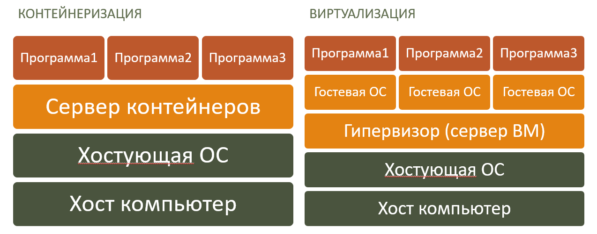

# Introduction / History

- [Introduction / History](#introduction--history)
  - [The idea of process isolation](#the-idea-of-process-isolation)
  - [The concept of containerization](#the-concept-of-containerization)
  - [Application area](#application-area)
  - [Advantages and disadvantages](#advantages-and-disadvantages)
  - [History of containerization](#history-of-containerization)
  - [Bibliography](#bibliography)

## The idea of process isolation

*Process isolation* is the ability to run multiple processes within a single operating system, but with isolated resources. Such processes cannot affect each other, their work is independent of each other. Process isolation allows you to run multiple applications on a single host without worrying that one application may affect the operation of another. Process isolation allows you to run multiple applications on a single host without worrying that one application may affect the operation of another.

The goal of process isolation is security and reliability of application operation. If one application fails, it does not affect the operation of other applications. If one application is attacked, it does not affect the operation of other applications.

## The concept of containerization

*Virtualization* is a technology that allows you to run an instance of an operating system within another operating system (called the *host*). For virtualization, a hypervisor (virtualization program) implements hardware emulation, i.e. creates a virtual machine on which an operating system is installed. Virtualization allows you to run multiple instances of an operating system on a single host. Each instance has its own processes, file system, network interfaces, and users.

*Containerization* is a method of virtualization that uses the resources of the operating system kernel. This is different from traditional virtualization, which involves hardware emulation. Containerization is often used to create isolated instances of specific applications, rather than the entire operating system. These isolated instances of applications are called containers.

Containerization, unlike virtualization, consumes significantly fewer resources because:

- does not emulate hardware, but provides access to host hardware;
- does not create a guest operating system that consumes additional resources.

## Application area

Despite the fact that the original idea of containerization was about security and reliability, containers are now mainly used for developing, testing, and deploying software products. Containers allow you to create software products that work on any operating system, do not depend on hardware, and do not require the installation of additional dependencies.

The containers application area includes:

- *Development of software products* - creating software products is possible for any operating system;
- *Testing of software products* - debugging programs in containers is safer and easier;
- *Assembly of software products* - assembling programs in containers helps to avoid dependency problems;
- *Deployment of information systems* - deploying a cluster of containers comes down to creating and running containers based on images.

## Advantages and disadvantages

The success of containerization technology is ensured by its advantages, such as:

- *Ease of creation* - containers are easy to create, run, and delete;
- *Flexible environment* - creating, restarting, and deleting containers is significantly faster than working with virtual machines;
- *Low resource consumption* - unlike virtualization, containers use a shared OS kernel, allowing you to run many containers on one host;
- *Increased performance* - unlike virtualization, containers use a shared OS kernel, allowing you to run many containers on one host;
- *Portability* - the container embeds all dependencies;
- *Standardization* - based on open standards;
- *Security* - each container isolates its processes from each other and from the host.

However, there are some disadvantages to containerization:

- *Limited capabilities* - containers cannot work with hardware directly;
- *Increased complexity of managing a container cluster* - managing the interaction of a group of containers is a non-trivial task.

These disadvantages are overcome with the development of containerization technology, as well as with the description of recommendations for using containers. Despite these disadvantages, containers are one of the most popular technologies in the field of software development and deployment.

## History of containerization

The history of containerization development includes virtualization, process isolation, and containerization.

The first attempts at virtualization were made in the 1960s. The first experiments in this direction were carried out by employees of the IBM research center, who developed software emulators for IBM 7040 computers that allowed multiple instances of an application to run on a single machine. In 1966, the first virtual machine IBM VM/370 was created. In the future, such emulators were to contribute to the development of hardware-independent programs and facilitate the porting of code to computers with other architectures. Virtualization was also required to improve high-level programming languages: it was used to create a runtime environment for user applications, replicate the operating environment, and emulate the processor's command system.

If the appearance of virtual machines was a starting point for the development of containerization systems, then the turning point in their history was undoubtedly 1979, when AT&T and Bell Laboratories developed the 7th version of Unix. Among other innovations in this version was the system call **chroot**, which changes the location of the process's root folder and its child elements. A program launched in the modified root directory will only have access to files in that directory. This laid the foundation for process isolation and file access separation for each process in Unix. In 1982, chroot was included in the BSD, allowing similar isolation mechanisms to be used in derivative systems.

In 1999, within one BSD operating system, it was possible to run several isolated copies of the OS using a common kernel. This technology was called **FreeBSD Jail**. It allowed the creation of isolated environments in which applications could be run without affecting the operation of other applications. FreeBSD Jail was based on chroot.

In 2005, Sun Microsystems introduced **Solaris Containers** — the first implementation of containers. Solaris Containers allowed multiple isolated instances of the Solaris operating system to run on a single host. Each instance had its own processes, file system, network interfaces, and users. Solaris Containers were based on FreeBSD Jail.

In 2007, Google introduced the **cgroups** (control groups) process management technology. Technologically, cgroups are a group of processes for which various resource restrictions are imposed at the operating system level — memory, I/O, network. Such isolated groups of processes can be combined into hierarchical systems and managed. Cgroups not only implement isolation, but also prioritization (different groups can be allocated different amounts of resources) and strict accounting. In 2008, cgroups functionality was included in the Linux kernel.

In 2013, the company Docker introduced the **Docker** containerization system. Docker allows you to create application images, run containers, and manage them. Since the appearance of Docker on the market and the introduction of many cloud service providers offering container services based on it, the popularity of this technology has been rapidly growing. In fact, Docker has become the founder of an entire ecosystem for managing containers. One of the brightest representatives of this family is Kubernetes.

*This course will focus on Docker containers.*

In 2014, Google introduced the **Kubernetes** orchestration system. Kubernetes allows you to run and manage multiple containers. Kubernetes quickly became the most popular system for automating the deployment, scaling, and management of industrial-grade containerized applications.

The security and convenience of containers, as well as the high speed of deployment, led to the emergence of a separate DevOps direction aimed at developing containerized applications that reduce the time to market for new projects. Since the appearance of Kubernetes, most of the largest players in the cloud technology market, including VMWare, Azure, AWS, and others, have announced their support for it on top of their own infrastructures. Containerization systems are continuously evolving, new tools are emerging for creating and deploying containerized applications, as well as for managing large container clusters in data centers. Kubernetes supports increasingly complex classes of applications, allowing enterprises to transition to hybrid clouds and microservices architectures. Containerization has become the foundation of modern software infrastructure, and Kubernetes is used in most large corporate projects today.

## Bibliography

- [CyberPaul, В изоляции. История появления и развития контейнеров, Serverspace, Habr.com](https://habr.com/ru/companies/serverspace/articles/741874/)
- [Docker, Docker History](https://docs.docker.com/engine/docker-overview/#docker-engine)
- [Wikipedia, FreeBSD Jail](https://en.wikipedia.org/wiki/FreeBSD_jail)
- [Wikipedia, Solaris Containers](https://en.wikipedia.org/wiki/Solaris_Containers)
- [Wikipedia, Docker](https://en.wikipedia.org/wiki/Docker_(software))
- [chroot, Wikipedia](https://en.wikipedia.org/wiki/Chroot)
- [cgroups, Wikipedia](https://en.wikipedia.org/wiki/Cgroups)
- [Kubernetes, Wikipedia](https://en.wikipedia.org/wiki/Kubernetes)
